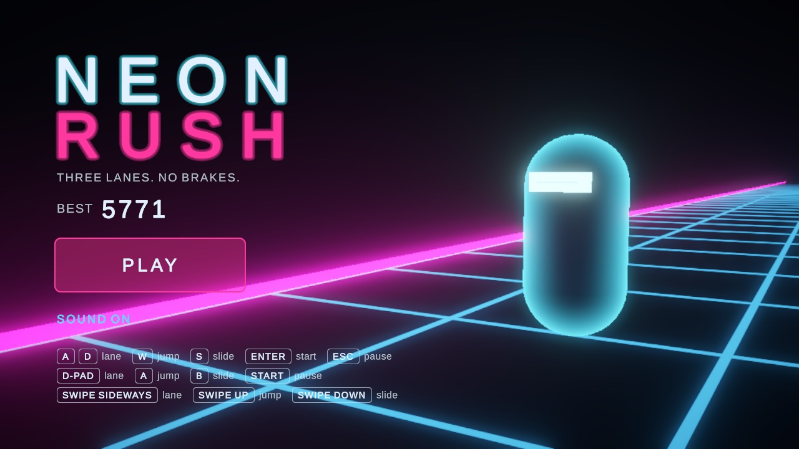
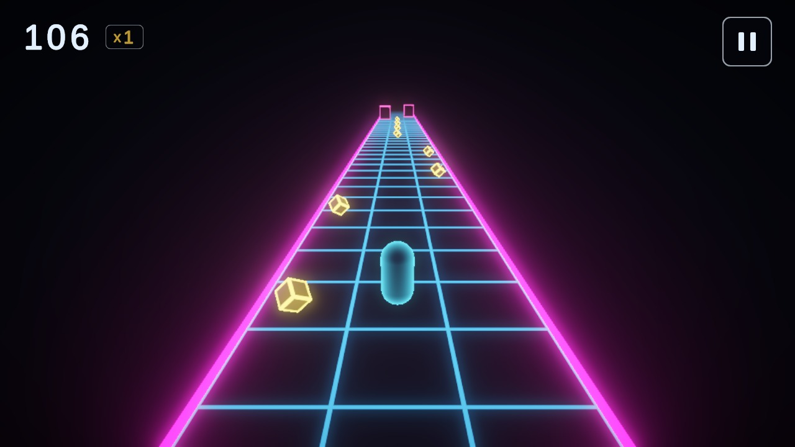
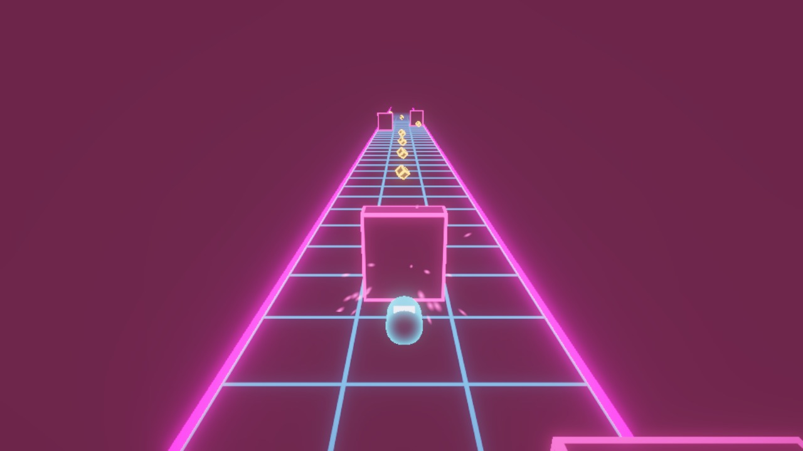
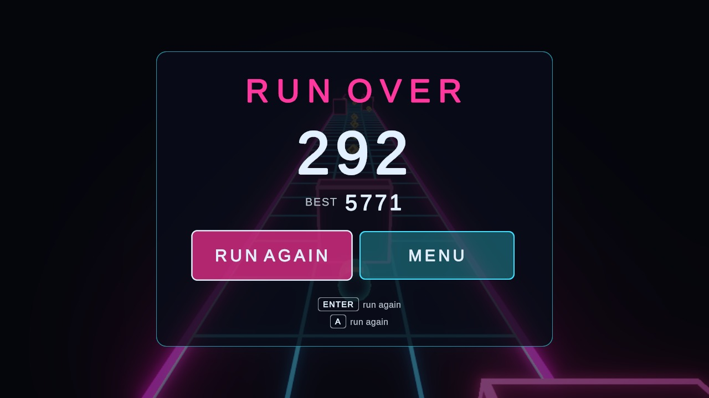

# Neon Rush

A fast arcade runner for the browser, Windows and Android, built small but structured like a production game.

**Status:** in development, and built for the browser while it is. The full loop is playable: a title screen with the runner facing the camera, a camera move round behind it into the run, pause, a crash with sparks and a shake, game over and retry, with keyboard, gamepad, mouse or touch. Three lanes, jump, slide, three kinds of hazard, pickups with a combo multiplier, a difficulty curve, sound effects, music and a saved best score. The game also builds for Windows and Android from the same code; those builds will be made and tested again once the game itself is settled. The audio is synthesised placeholder. What the game costs to download and run today is measured in [docs/performance.md](docs/performance.md); cutting the download down comes later.

| | |
| --- | --- |
|  |  |
|  |  |

## Overview

Neon Rush is my take on the endless runner. It has to download quickly, start quickly and hold its frame rate on an ordinary laptop or phone. I'm using it to show how I structure a Unity project when I expect it to grow: modules with enforced boundaries, logic that runs without the engine, content that is data, one codebase for every platform, and one place where everything is wired together.

## Controls

| Action | Keyboard | Gamepad | Touch or mouse |
| --- | --- | --- | --- |
| Start / run again | Enter or Space | A / Cross | Play button |
| Move between buttons | Arrows or W A S D | D-pad or left stick | |
| Change lane | A / D or Left / Right | D-pad or left stick | Swipe sideways |
| Jump | W, Up or Space | A / Cross | Swipe up |
| Slide (in the air: dive) | S or Down | B / Circle | Swipe down |
| Pause | Esc or P | Start | Pause button |
| Sound on / off | | | Toggle on the title screen and the pause panel |

Which of these are live depends on the platform: Windows listens to the keyboard and gamepad, Android to touch and a paired gamepad, the browser to all three. The hints on the title screen show only what applies.

## Features

- **Lane runner** with a jump arc, a slide, a mid-air dive, and a short input buffer so a press that is a few frames early still counts.
- **Three hazards from one rule.** A hurdle is a low box, a gate is a box that starts above a sliding runner, a barrier is a tall one. Jumping over and sliding under fall out of the same overlap test.
- **Track made of data.** Hazards, pickups and the patterns they appear in are assets. New content doesn't need new code. Their prefabs load through Addressables at start-up, behind one interface, so they can be shipped or swapped separately from the game.
- **Difficulty that stays fair.** Speed rises along a curve and harder patterns unlock by tier, but rows are spaced by travel time, so the reaction window doesn't shrink.
- **Seeded runs.** The same seed lays out the same track.
- **Scoring** from distance and pickups, with a combo multiplier and a saved best score.
- **A cinematic start.** The title screen is a camera shot of the runner. Pressing play swings the camera round behind it, and the run begins as it arrives. Shots are stored as orbits and a framing, so the move goes round the runner and the composition holds at any aspect ratio.
- **Feedback on every event.** A flash, a camera shake, a spark burst and the runner going down on a crash; a sparkle and a rising note on each pickup in a streak; a sound for every move. The game-over screen waits for the crash to play out.
- **Sound and effects that only listen.** Neither is called by gameplay code. They react to the messages the game already sends, so taking the sound feature out leaves a silent game and nothing else changes.
- **One codebase, three platforms.** No `#if UNITY_ANDROID` and no platform checks in gameplay or UI. What differs per platform (frame-rate target, active input devices) is a slot in an asset.
- **Layered input.** Gameplay consumes actions like "jump" and never sees a device. Keys and buttons are one source, swipes are another, and the platform's input profile decides which exist. A press on an on-screen button is never also a swipe.
- **Every screen works from keys or a gamepad.** Arrows or the d-pad move a highlight across a screen's buttons and Enter or A presses it. The highlight only shows once you use them. Leaving the window or the tab pauses the run.
- **UI in UI Toolkit, model–view–presenter.** Four screens in one document, presenters with no engine types that are tested against fake views, and a layout that keeps clear of notches and scales to any aspect ratio.
- **No per-frame garbage** in the gameplay loop or the HUD: entities and their views are pooled, messages are structs, and the score is a row of reels that slide, because UI Toolkit allocates every time a label's text changes. Tests fail if the game's code allocates, and one measures whole frames on the live HUD.

## Tech stack

- Unity 6 (`6000.5.8f1`), URP, two small custom HLSL shaders
- C#, VContainer for dependency injection
- Input System, UI Toolkit, Addressables, Unity Test Framework

## Architecture

```
App        composition roots, game flow, platform set-up
Features   Pace · Player · Track · Scoring · Screens · Cameras · Effects · Sound      (none references another)
Shared     contracts between features
Core       com.roadandcode.core, game-agnostic
```

Each layer is its own assembly and can only see the layers below it, so a feature reaching into another feature doesn't compile. Game rules and UI presenters are plain C# classes with no `MonoBehaviour`, which is why they are covered by 350+ EditMode tests. There are no singletons and no `Update` methods on gameplay objects: one simulation loop ticks every system in a fixed, documented order.

[docs/architecture.md](docs/architecture.md) has the module map, the frame order, the message table, the platform and input layers, how the screens, camera and sound are put together, and the reasoning behind the decisions.

## Performance

From the browser build at 1280 × 720 on a fast desktop, so this is what the game asks for, not proof of how it runs on a slow machine:

| | |
| --- | --- |
| Download | 17.2 MB (gzip): 11.5 MB of code, 5.9 MB of data |
| Start-up | 3.0 to 3.5 s to the title screen, served locally |
| Script time per frame in a run | about 1 ms median, 1.4 to 1.6 ms at the 99th percentile |
| Worst frame | 2 ms once warm; one frame of up to 18 ms in the first run after loading |
| Draw calls | 26 on the title screen, 35 to 38 in a run, 47 at most |
| Triangles | under 1,700 |

[docs/performance.md](docs/performance.md) has how each number was taken, what the HUD taught me about UI Toolkit and garbage, and what has not been measured yet.

## Build & run

Open the project in Unity `6000.5.8f1` and press Play in `Assets/_Project/Content/Scenes/Bootstrap.unity`. Always start from Bootstrap: it loads the gameplay scene itself. To try the phone or browser set-up in the editor, tick **Simulate Platform** on the `App` object in that scene.

From a terminal:

```bash
# tests
Unity -batchmode -projectPath . -runTests -testPlatform EditMode -testResults Logs/editmode.xml
Unity -batchmode -projectPath . -runTests -testPlatform PlayMode -testResults Logs/playmode.xml

# builds, into Builds/<target>
Unity -batchmode -quit -projectPath . -buildTarget WebGL -executeMethod RoadAndCode.Core.Editor.CommandLineBuild.Build
Unity -batchmode -quit -projectPath . -buildTarget StandaloneWindows64 -executeMethod RoadAndCode.Core.Editor.CommandLineBuild.Build
Unity -batchmode -quit -projectPath . -buildTarget Android -executeMethod RoadAndCode.Core.Editor.CommandLineBuild.Build
```
